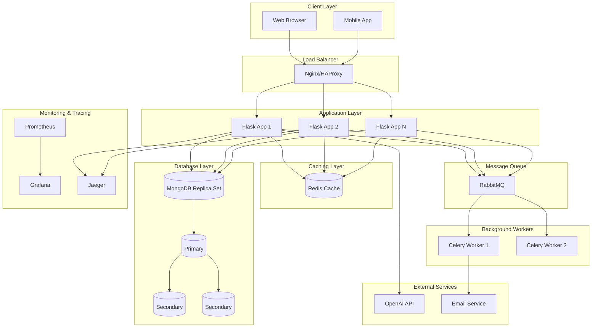
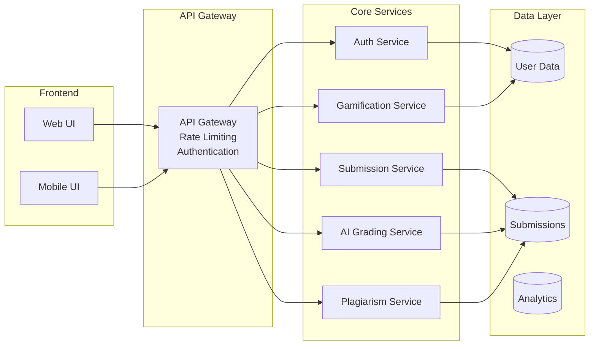
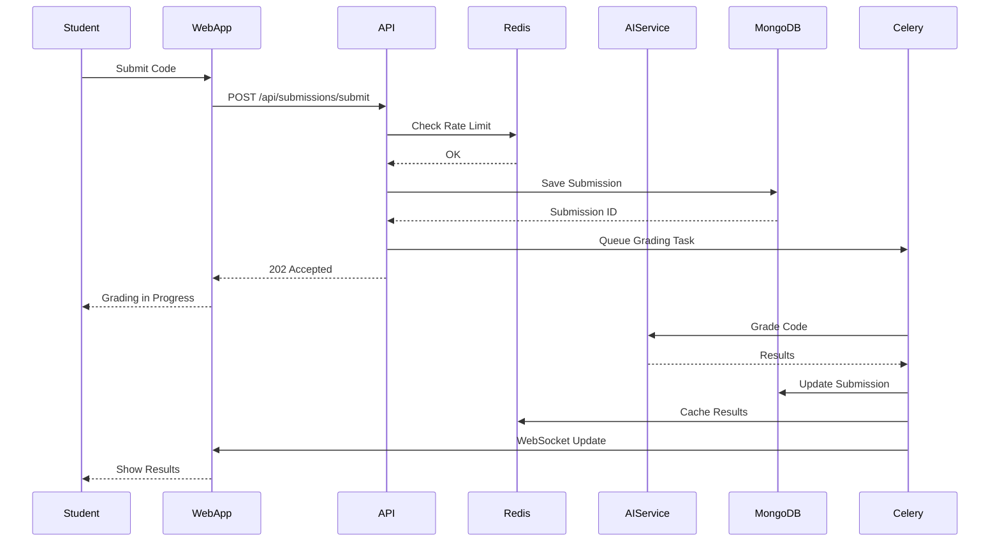
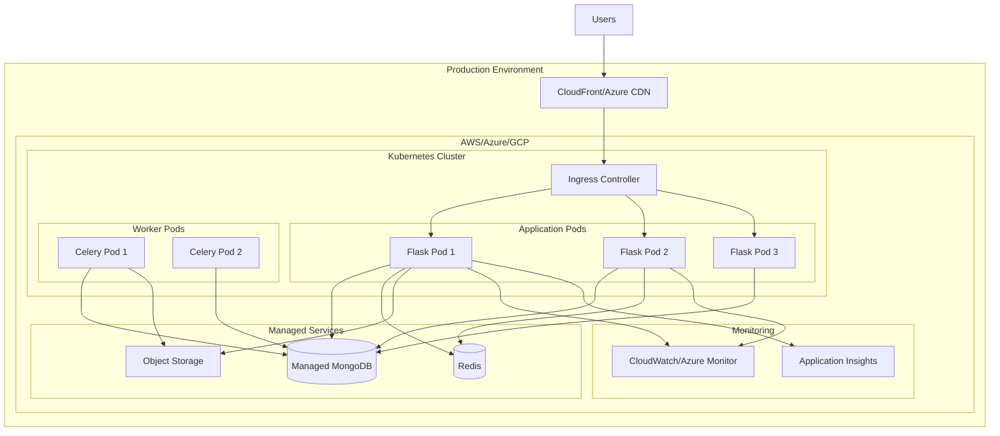
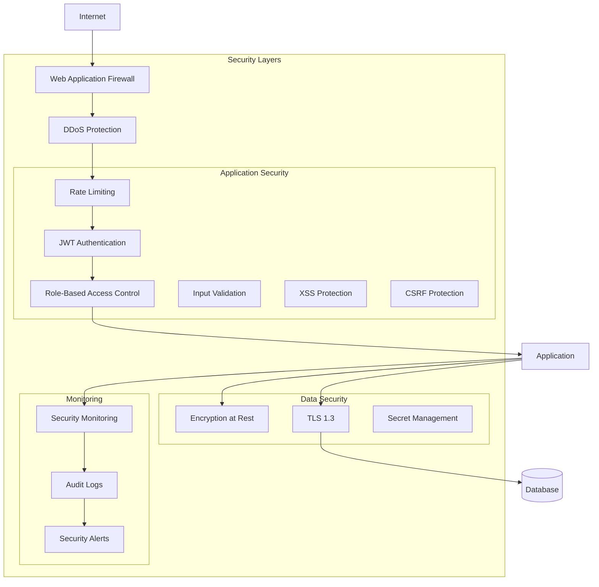
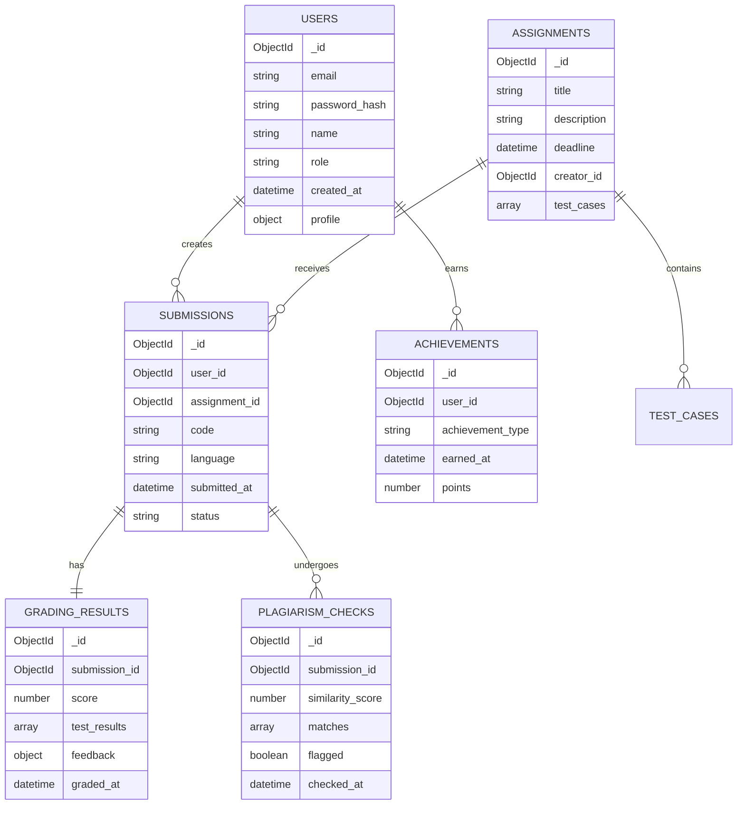
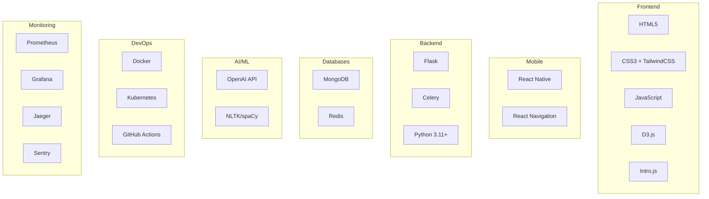
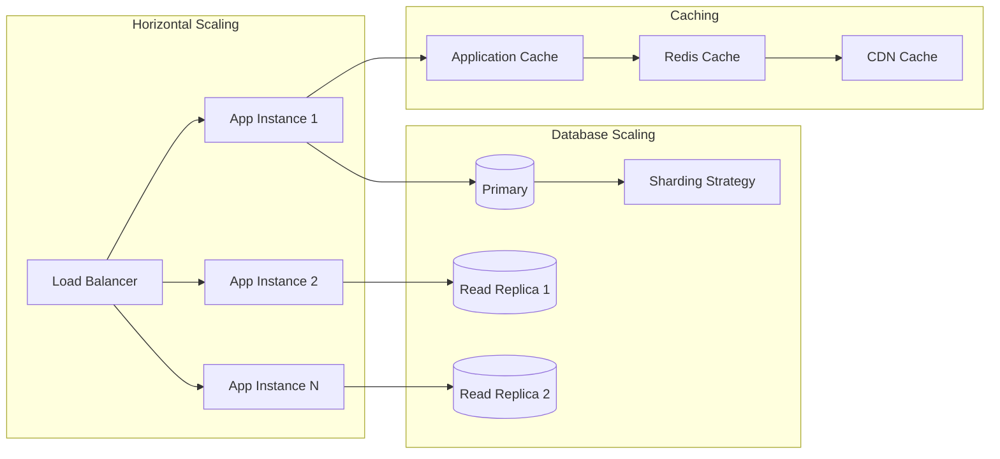

# System Architecture

## High-Level Architecture

## Component Diagram

## Data Flow Diagram

## Deployment Architecture

## Security Architecture

## Database Schema

## Technology Stack

## Scaling Strategy

